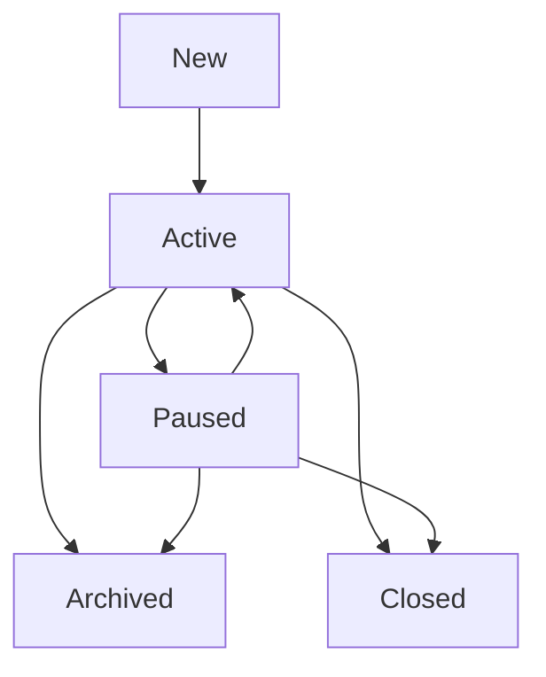

# Conversations

Conversations are the core interaction mechanism for chatbot agents in LLM Crafter. They provide stateful, multi-turn interactions with automatic context management and intelligent summarization.

## Overview

Conversations in LLM Crafter are designed to handle long-running interactions efficiently while preserving important context and minimizing token costs.

### Key Features

- **Stateful Interactions**: Maintain context across multiple messages
- **Automatic Summarization**: Reduce token usage by up to 70%
- **User Identification**: Support for multiple users per agent
- **Context Preservation**: Important information is retained across sessions
- **Performance Optimization**: Intelligent context management

## Conversation Structure

### Basic Conversation Model

```json
{
  "_id": "conv_abc123",
  "agent": "agent_xyz789",
  "user_identifier": "user_12345",
  "status": "active",
  "messages": [
    {
      "_id": "msg_001",
      "role": "user",
      "content": "Hello, I need help with my account",
      "timestamp": "2024-01-16T10:30:00Z",
      "token_usage": {
        "prompt_tokens": 15,
        "total_tokens": 15
      }
    },
    {
      "_id": "msg_002", 
      "role": "assistant",
      "content": "I'd be happy to help you with your account. What specific issue are you experiencing?",
      "timestamp": "2024-01-16T10:30:05Z",
      "token_usage": {
        "prompt_tokens": 45,
        "completion_tokens": 22,
        "total_tokens": 67,
        "cost": 0.0013
      },
      "tools_used": []
    }
  ],
  "metadata": {
    "total_messages": 2,
    "total_tokens_used": 82,
    "total_cost": 0.0013,
    "tools_executed_count": 0,
    "last_activity": "2024-01-16T10:30:05Z",
    "last_summary_index": -1,
    "summary_version": 0,
    "requires_summarization": false
  },
  "conversation_summary": null,
  "summary": null,
  "created_at": "2024-01-16T10:30:00Z",
  "updated_at": "2024-01-16T10:30:05Z"
}
```

### Message Types

#### User Messages
```json
{
  "role": "user",
  "content": "What's the weather like today?",
  "timestamp": "2024-01-16T10:30:00Z",
  "metadata": {
    "user_agent": "Mozilla/5.0...",
    "ip_address": "192.168.1.100"
  }
}
```

#### Assistant Messages
```json
{
  "role": "assistant",
  "content": "Let me check the current weather for you.",
  "timestamp": "2024-01-16T10:30:05Z",
  "token_usage": {
    "prompt_tokens": 156,
    "completion_tokens": 12,
    "total_tokens": 168,
    "cost": 0.0034
  },
  "tools_used": [
    {
      "tool_name": "api_caller",
      "parameters": {"endpoint_name": "get_weather"},
      "result_summary": "Retrieved weather data for current location"
    }
  ],
  "model_used": "gpt-4o-mini",
  "is_summarized": false
}
```

#### System Messages
```json
{
  "role": "system",
  "content": "You are a helpful customer service assistant.",
  "timestamp": "2024-01-16T10:30:00Z",
  "is_system_prompt": true
}
```

## Conversation Lifecycle

### 1. Conversation Creation

Conversations are automatically created when a user first interacts with a chatbot agent:

```bash
POST /api/v1/organizations/{orgId}/projects/{projectId}/agents/{agentId}/chat
```

```json
{
  "message": "Hello, I need help",
  "user_identifier": "user_12345"
}
```

**Response includes conversation ID:**
```json
{
  "response": "Hello! I'm here to help. What can I assist you with today?",
  "conversation_id": "conv_abc123",
  "message_id": "msg_def456"
}
```

### 2. Continuing Conversations

Subsequent messages use the same conversation ID:

```json
{
  "message": "I have a billing question",
  "user_identifier": "user_12345",
  "conversation_id": "conv_abc123"
}
```

### 3. Automatic Context Management

As conversations grow, LLM Crafter automatically manages context:

- **Short conversations**: Full message history included
- **Medium conversations**: Recent messages + summary
- **Long conversations**: Summary + recent messages only

### 4. Conversation Summarization

When conversations exceed thresholds (15 messages or 4000 tokens):

1. **Trigger Detection**: System identifies need for summarization
2. **Content Analysis**: Extract key information from old messages
3. **Summary Generation**: Create structured summary using LLM
4. **Context Update**: Replace old messages with summary
5. **Token Optimization**: Dramatically reduce context size

## User Identification

### User Identifiers

User identifiers allow multiple users to interact with the same agent while maintaining separate conversation histories:

```json
{
  "user_identifier": "user_12345",  // Required
  "metadata": {
    "user_name": "John Doe",        // Optional
    "user_email": "john@example.com", // Optional
    "session_id": "session_abc"     // Optional
  }
}
```

### User Isolation

- Each user has separate conversation histories
- No cross-user data leakage
- Independent context management per user

### Anonymous Users

```json
{
  "user_identifier": "anonymous_" + generateUUID(),
  "metadata": {
    "is_anonymous": true,
    "session_start": "2024-01-16T10:30:00Z"
  }
}
```

## Context Management

### Context Building

LLM Crafter builds conversation context intelligently:

```javascript
function buildContext(conversation, maxTokens = 4000) {
  const context = [];
  
  // Always include system prompt
  context.push(systemMessage);
  
  // Include summary if available
  if (conversation.conversation_summary) {
    context.push({
      role: "system",
      content: buildSummaryContext(conversation.conversation_summary)
    });
  }
  
  // Add recent messages within token limit
  const recentMessages = getRecentMessages(conversation, maxTokens);
  context.push(...recentMessages);
  
  return context;
}
```

### Token Estimation

```javascript
function estimateTokens(text) {
  // Rough estimation: 1 token ≈ 4 characters
  return Math.ceil(text.length / 4);
}
```

### Context Optimization

- **Summary Integration**: Older messages replaced with structured summaries
- **Recent Priority**: Most recent messages always included
- **Token Budgeting**: Context stays within model limits
- **Quality Preservation**: Important information retained

## API Operations

### Start a Conversation

```bash
POST /api/v1/organizations/{orgId}/projects/{projectId}/agents/{agentId}/chat
```

```json
{
  "message": "Hello, I'm looking for help with my order",
  "user_identifier": "customer_12345",
  "dynamic_context": {
    "customer_tier": "premium",
    "recent_orders": ["ORD-123", "ORD-124"]
  }
}
```

### Continue a Conversation

```bash
POST /api/v1/organizations/{orgId}/projects/{projectId}/agents/{agentId}/chat
```

```json
{
  "message": "Actually, I want to cancel order ORD-123",
  "user_identifier": "customer_12345",
  "conversation_id": "conv_abc123"
}
```

### List Conversations

```bash
GET /api/v1/organizations/{orgId}/projects/{projectId}/agents/{agentId}/conversations
```

**Query Parameters:**
- `user_identifier`: Filter by user
- `status`: Filter by status (active, archived, closed)
- `limit`: Number of conversations per page
- `page`: Page number

**Response:**
```json
{
  "conversations": [
    {
      "_id": "conv_abc123",
      "user_identifier": "customer_12345",
      "status": "active",
      "message_count": 12,
      "last_activity": "2024-01-16T15:30:00Z",
      "created_at": "2024-01-16T10:00:00Z"
    }
  ],
  "pagination": {
    "page": 1,
    "limit": 10,
    "total": 45,
    "pages": 5
  }
}
```

### Get Conversation Details

```bash
GET /api/v1/organizations/{orgId}/projects/{projectId}/agents/{agentId}/conversations/{conversationId}
```

**Response:**
```json
{
  "conversation": {
    "_id": "conv_abc123",
    "agent": "agent_xyz789",
    "user_identifier": "customer_12345",
    "status": "active",
    "messages": [...],
    "metadata": {...},
    "conversation_summary": {...}
  }
}
```

### Archive Conversation

```bash
PUT /api/v1/organizations/{orgId}/projects/{projectId}/agents/{agentId}/conversations/{conversationId}
```

```json
{
  "status": "archived"
}
```

## Conversation Status

### Status Types

- **active**: Ongoing conversation
- **paused**: Temporarily inactive
- **archived**: Completed conversation
- **closed**: Terminated conversation

### Status Transitions



### Automatic Status Management

- **Auto-pause**: After 24 hours of inactivity
- **Auto-archive**: After 7 days of inactivity
- **Manual control**: Status can be set via API

## Performance Optimization

### Token Efficiency

**Before Summarization:**
```json
{
  "conversation_length": 25,
  "total_tokens": 3500,
  "context_tokens_per_request": 3200,
  "estimated_cost_per_request": "$0.016"
}
```

**After Summarization:**
```json
{
  "conversation_length": 25,
  "summary_tokens": 200,
  "recent_messages_tokens": 800,
  "context_tokens_per_request": 1000,
  "estimated_cost_per_request": "$0.005",
  "savings": "69% reduction"
}
```

### Response Time Optimization

- **Context Caching**: Frequently accessed conversations cached
- **Lazy Loading**: Messages loaded on demand
- **Batch Operations**: Multiple operations combined
- **Connection Pooling**: Database connections optimized

### Memory Management

- **Message Pagination**: Large conversations paginated
- **Summary Storage**: Summaries stored separately
- **Index Optimization**: Database indexes for fast queries
- **TTL Policies**: Old conversations auto-archived

## Advanced Features

### Dynamic Context

Add real-time context to conversations:

```json
{
  "message": "What's my account status?",
  "user_identifier": "customer_12345",
  "dynamic_context": {
    "account_balance": "$1,250.00",
    "last_login": "2024-01-15T09:30:00Z",
    "pending_orders": 2,
    "support_tier": "gold"
  }
}
```

### Conversation Templates

Pre-configure conversation starters:

```json
{
  "templates": {
    "customer_support": {
      "initial_message": "Hello! I'm here to help with your account and orders. How can I assist you today?",
      "suggested_actions": [
        "Check order status",
        "Update account information", 
        "Report an issue"
      ]
    }
  }
}
```

### Multi-Language Support

```json
{
  "message": "Bonjour, j'ai besoin d'aide",
  "user_identifier": "customer_fr_123",
  "metadata": {
    "language": "fr",
    "detected_language": "french"
  }
}
```

### Conversation Branching

Handle complex conversation flows:

```json
{
  "conversation_flow": {
    "current_step": "gathering_info",
    "previous_steps": ["greeting", "issue_identification"],
    "next_possible_steps": ["solution_presentation", "escalation"]
  }
}
```

## Monitoring and Analytics

### Conversation Metrics

```bash
GET /api/v1/organizations/{orgId}/projects/{projectId}/agents/{agentId}/analytics/conversations
```

**Response:**
```json
{
  "metrics": {
    "total_conversations": 1543,
    "active_conversations": 87,
    "average_length": 8.5,
    "average_duration": "12m 30s",
    "completion_rate": 89.2,
    "user_satisfaction": 4.3
  },
  "trends": {
    "conversations_per_day": [45, 52, 48, 61, 55],
    "average_response_time": [1.2, 1.1, 1.3, 1.0, 1.1]
  }
}
```

### User Engagement

- **Session Duration**: How long users engage
- **Message Frequency**: Messages per conversation
- **Return Rate**: Users returning for new conversations
- **Resolution Rate**: Successful issue resolution

### Cost Analysis

```json
{
  "cost_analysis": {
    "total_cost": "$156.78",
    "cost_per_conversation": "$0.102",
    "token_efficiency": {
      "without_summarization": "$245.30",
      "with_summarization": "$156.78",
      "savings": "$88.52 (36%)"
    }
  }
}
```

## Best Practices

### Conversation Design

#### Clear System Prompts
```json
{
  "system_prompt": "You are Alex, a customer service representative for TechCorp. You help customers with orders, accounts, and technical issues. Always be friendly, professional, and thorough. If you can't solve an issue, offer to escalate to a human agent."
}
```

#### User Identification Strategy
```javascript
// For authenticated users
const userIdentifier = `customer_${userId}`;

// For anonymous users  
const userIdentifier = `anonymous_${sessionId}`;

// For different channels
const userIdentifier = `${channel}_${userId}`; // e.g., "web_12345", "mobile_12345"
```

### Performance Optimization

#### Context Management
- Keep system prompts concise but specific
- Use dynamic context for real-time data
- Configure appropriate summarization thresholds

#### Token Management
- Monitor conversation lengths
- Use cost-effective models for summarization
- Implement conversation archiving policies

### Security Considerations

#### Data Privacy
- Anonymize sensitive information
- Implement data retention policies
- Secure user identification schemes

#### Access Control
- Validate user permissions
- Implement rate limiting per user
- Monitor for abuse patterns

## Troubleshooting

### Common Issues

#### Conversations Not Found
```json
{
  "error": "Conversation not found",
  "code": "CONVERSATION_NOT_FOUND",
  "details": {
    "conversation_id": "conv_invalid",
    "user_identifier": "user_12345"
  }
}
```

**Solution**: Verify conversation ID and user permissions.

#### Context Too Large
```json
{
  "error": "Context exceeds maximum token limit",
  "code": "CONTEXT_TOO_LARGE",
  "details": {
    "current_tokens": 8192,
    "max_tokens": 4096
  }
}
```

**Solution**: Trigger manual summarization or adjust context limits.

#### Summarization Failures
```json
{
  "warning": "Summarization failed, using fallback",
  "details": {
    "error": "API timeout",
    "fallback_method": "truncation"
  }
}
```

**Solution**: Check API key validity and network connectivity.

### Debugging

Enable detailed logging:

```bash
LOG_LEVEL=debug npm start
```

This provides detailed information about:
- Context building process
- Token calculations
- Summarization triggers
- Performance metrics

## Integration Examples

### Web Application

```javascript
class ConversationManager {
  constructor(apiClient, agentId) {
    this.client = apiClient;
    this.agentId = agentId;
    this.conversationId = null;
  }
  
  async sendMessage(message, userId) {
    const response = await this.client.post(`/agents/${this.agentId}/chat`, {
      message,
      user_identifier: userId,
      conversation_id: this.conversationId
    });
    
    this.conversationId = response.conversation_id;
    return response;
  }
  
  async getHistory() {
    if (!this.conversationId) return [];
    
    const response = await this.client.get(`/agents/${this.agentId}/conversations/${this.conversationId}`);
    return response.conversation.messages;
  }
}
```

### Chat Widget

```javascript
class ChatWidget {
  constructor(element, agentId, userId) {
    this.element = element;
    this.conversation = new ConversationManager(apiClient, agentId);
    this.userId = userId;
    this.setupUI();
  }
  
  async sendMessage(text) {
    this.addMessage('user', text);
    
    try {
      const response = await this.conversation.sendMessage(text, this.userId);
      this.addMessage('assistant', response.response);
    } catch (error) {
      this.addMessage('system', 'Sorry, something went wrong. Please try again.');
    }
  }
  
  addMessage(role, content) {
    const messageEl = document.createElement('div');
    messageEl.className = `message message-${role}`;
    messageEl.textContent = content;
    this.element.appendChild(messageEl);
  }
}
```

Conversations are the heart of interactive AI experiences in LLM Crafter, providing efficient, context-aware interactions that scale from simple Q&A to complex, multi-turn dialogues.
