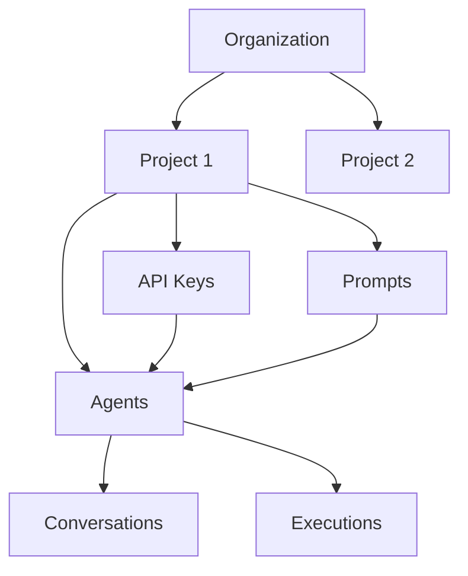

# Organizations & Projects

LLM Crafter uses a hierarchical structure to organize resources: Organizations contain Projects, which contain Agents, API Keys, and other resources.

## Organizations

Organizations represent the top-level entity in LLM Crafter. They provide:

- **Multi-tenancy**: Complete data isolation between organizations
- **Team Management**: User roles and permissions
- **Resource Grouping**: Logical separation of projects and resources
- **Billing Boundaries**: Cost tracking and usage monitoring

### Organization Structure

```json
{
  "_id": "org_abc123",
  "name": "Acme Corporation",
  "description": "AI initiatives for Acme Corp",
  "members": [
    {
      "user": "user_123",
      "role": "admin",
      "joined_at": "2024-01-15T10:30:00Z"
    }
  ],
  "settings": {
    "default_llm_provider": "openai",
    "max_agents_per_project": 50,
    "conversation_retention_days": 90
  },
  "created_at": "2024-01-15T10:30:00Z",
  "updated_at": "2024-01-15T10:30:00Z"
}
```

### Member Roles

Organizations support three role levels:

#### Admin
- Full access to organization settings
- Can invite and remove members
- Can create and delete projects
- Can manage billing and usage

#### Member
- Can create and manage agents
- Can execute agent tasks
- Can view organization projects
- Cannot modify organization settings

#### Viewer
- Read-only access to projects and agents
- Can view conversation history
- Cannot create or modify resources
- Cannot execute agents

### Creating an Organization

```bash
POST /api/v1/organizations
```

```json
{
  "name": "My Company",
  "description": "AI automation for our business processes"
}
```

The user who creates an organization automatically becomes an admin.

### Managing Members

#### Invite a User

```bash
POST /api/v1/organizations/{orgId}/members
```

```json
{
  "email": "user@example.com",
  "role": "member"
}
```

#### Update Member Role

```bash
PUT /api/v1/organizations/{orgId}/members/{userId}
```

```json
{
  "role": "admin"
}
```

#### Remove Member

```bash
DELETE /api/v1/organizations/{orgId}/members/{userId}
```

## Projects

Projects are containers within organizations that group related AI resources. Each project can have:

- **Agents**: AI assistants and task workers
- **API Keys**: LLM provider credentials
- **Prompts**: Reusable prompt templates
- **Conversations**: Chat histories and interactions

### Project Structure

```json
{
  "_id": "proj_xyz789",
  "name": "Customer Support Automation",
  "description": "AI agents for handling customer inquiries",
  "organization": "org_abc123",
  "settings": {
    "default_model": "gpt-4o-mini",
    "max_conversation_length": 50,
    "auto_summarization": true
  },
  "created_at": "2024-01-16T09:15:00Z",
  "updated_at": "2024-01-16T09:15:00Z"
}
```

### Project Benefits

#### Resource Organization
- Group related agents together
- Separate development from production
- Organize by department or use case

#### Access Control
- Project-level permissions
- Isolated API keys and resources
- Separate conversation histories

#### Cost Tracking
- Monitor usage by project
- Allocate costs to departments
- Track ROI for specific initiatives

### Creating a Project

```bash
POST /api/v1/organizations/{orgId}/projects
```

```json
{
  "name": "Support Automation",
  "description": "AI agents for customer support",
  "settings": {
    "default_model": "gpt-4o-mini",
    "auto_summarization": true
  }
}
```

### Common Project Patterns

#### Development vs Production

```json
// Development Project
{
  "name": "Support Automation - Dev",
  "settings": {
    "default_model": "gpt-4o-mini",
    "conversation_retention_days": 7,
    "debug_mode": true
  }
}

// Production Project  
{
  "name": "Support Automation - Prod",
  "settings": {
    "default_model": "gpt-4o",
    "conversation_retention_days": 90,
    "debug_mode": false
  }
}
```

#### Department-based Organization

```json
// Sales Department
{
  "name": "Sales AI Assistants",
  "description": "Lead qualification and sales support agents"
}

// Support Department
{
  "name": "Customer Support AI",
  "description": "Help desk and troubleshooting agents"
}

// Marketing Department
{
  "name": "Marketing Automation",
  "description": "Content generation and campaign optimization"
}
```

## Resource Hierarchy

The complete resource hierarchy in LLM Crafter:

```
Organization
├── Members (Users with roles)
├── Projects
│   ├── API Keys
│   ├── Agents
│   │   ├── Conversations (for chatbot agents)
│   │   └── Executions (for task agents)
│   ├── Prompts
│   └── Tools (custom)
└── Settings
```

### Resource Relationships



## Best Practices

### Organization Design

#### Single Organization
For small teams or single companies:
```
Acme Corp
├── Development
├── Testing  
└── Production
```

#### Multi-Organization
For agencies or large enterprises:
```
Client A Org
├── Project 1
└── Project 2

Client B Org  
├── Project 1
└── Project 2

Internal Org
├── R&D Projects
└── Internal Tools
```

### Project Structure

#### Feature-based Projects
```
E-commerce AI
├── Product Recommendations
├── Customer Support
└── Inventory Management
```

#### Environment-based Projects
```
Production Environment
├── Live Agents
└── Production APIs

Development Environment
├── Test Agents
└── Development APIs
```

### Naming Conventions

#### Organizations
- Use clear, descriptive names
- Include company or client identifier
- Example: "Acme Corp AI", "Client-ABC-Digital"

#### Projects
- Include purpose and environment
- Use consistent naming pattern
- Examples: "Support-Bot-Prod", "Sales-Assistant-Dev"

### Security Considerations

#### Organization Isolation
- Each organization has complete data separation
- No cross-organization access possible
- API keys are scoped to specific projects

#### Member Management
- Regularly audit member access
- Use least-privilege principle
- Remove inactive members promptly

#### Resource Scoping
- API keys are project-specific
- Agents cannot access other projects
- Conversations are isolated by project

## API Reference

### Organization Endpoints

```bash
# List organizations for current user
GET /api/v1/organizations

# Get specific organization
GET /api/v1/organizations/{orgId}

# Create organization
POST /api/v1/organizations

# Update organization
PUT /api/v1/organizations/{orgId}

# Delete organization (admin only)
DELETE /api/v1/organizations/{orgId}
```

### Project Endpoints

```bash
# List projects in organization
GET /api/v1/organizations/{orgId}/projects

# Get specific project
GET /api/v1/organizations/{orgId}/projects/{projectId}

# Create project
POST /api/v1/organizations/{orgId}/projects

# Update project
PUT /api/v1/organizations/{orgId}/projects/{projectId}

# Delete project
DELETE /api/v1/organizations/{orgId}/projects/{projectId}
```

### Member Management Endpoints

```bash
# List organization members
GET /api/v1/organizations/{orgId}/members

# Invite member
POST /api/v1/organizations/{orgId}/members

# Update member role
PUT /api/v1/organizations/{orgId}/members/{userId}

# Remove member
DELETE /api/v1/organizations/{orgId}/members/{userId}
```

## Examples

### Complete Setup Flow

```bash
# 1. Create organization
curl -X POST http://localhost:3000/api/v1/organizations \
  -H "Authorization: Bearer $TOKEN" \
  -H "Content-Type: application/json" \
  -d '{
    "name": "Acme AI Solutions",
    "description": "AI automation for business processes"
  }'

# 2. Create development project
curl -X POST http://localhost:3000/api/v1/organizations/{orgId}/projects \
  -H "Authorization: Bearer $TOKEN" \
  -H "Content-Type: application/json" \
  -d '{
    "name": "Customer Support - Dev",
    "description": "Development environment for support agents"
  }'

# 3. Create production project
curl -X POST http://localhost:3000/api/v1/organizations/{orgId}/projects \
  -H "Authorization: Bearer $TOKEN" \
  -H "Content-Type: application/json" \
  -d '{
    "name": "Customer Support - Prod", 
    "description": "Production support agents"
  }'

# 4. Invite team member
curl -X POST http://localhost:3000/api/v1/organizations/{orgId}/members \
  -H "Authorization: Bearer $TOKEN" \
  -H "Content-Type: application/json" \
  -d '{
    "email": "developer@acme.com",
    "role": "member"
  }'
```

This structure provides a solid foundation for organizing your AI resources at any scale, from small teams to large enterprises.
