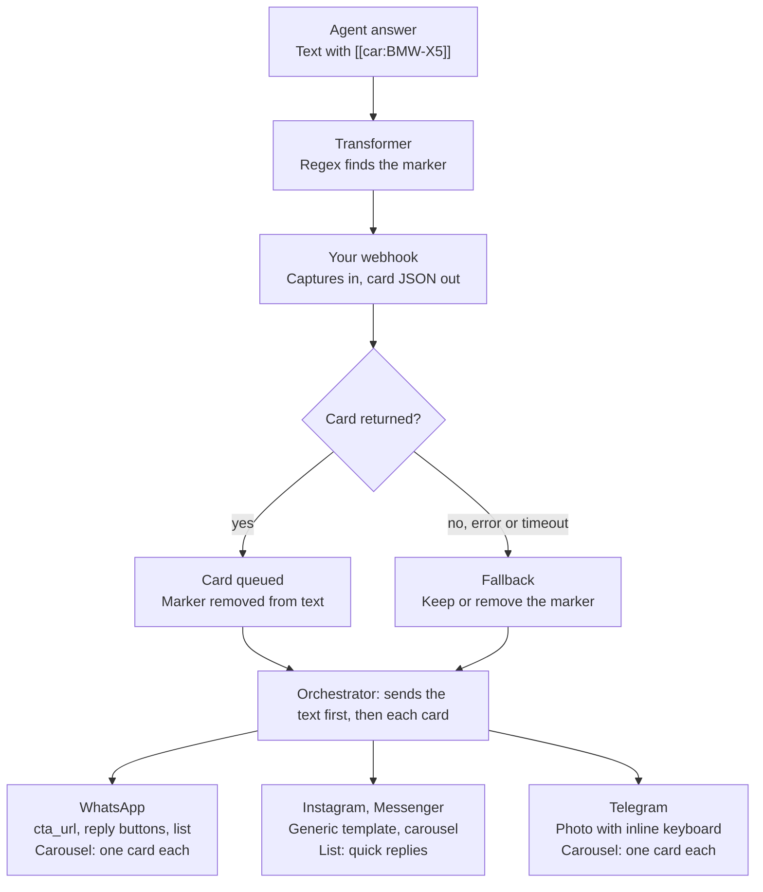

# Message Transformers

A message transformer turns a marker in the agent's answer into a native rich message: a WhatsApp interactive message, an Instagram or Messenger generic template (card or carousel), or quick replies. You write the marker into the agent's prompt, and your own webhook returns the card data for it.

Typical use: the agent answers "Here is the car I recommend [[car:BMW-X5]]". The transformer catches `[[car:BMW-X5]]`, calls your webhook with `BMW-X5`, and your webhook returns the title, price, image and buttons. The customer gets the text plus a card with a photo and "Test drive" / "View details" buttons.

Supported channels: WhatsApp (Meta Cloud API and Twilio), Instagram, Messenger and Telegram. The website widget does not run transformers.

Code: `src/services/messageTransformerService.js` runs the transformers, `src/services/channelOrchestrator.js` sends the result, and each channel service's `sendRichCard` builds the native message. Instagram and Messenger share `src/services/channels/metaTemplateBuilder.js`.

## How it works



Each match calls the webhook once, in order. The customer first gets the remaining text, then one message per card in that channel's native format. If a channel rejects a card, the orchestrator sends a text version of it instead.

## Configuration

Transformers live on the agent, in the `message_transformers` array. Send it on agent create (`POST`) or update (`PUT`); the API rejects an invalid regex or a non-http(s) URL with a 400.

```json
{
  "message_transformers": [
    {
      "name": "Car cards",
      "pattern": "\\[\\[car:([A-Za-z0-9-]+)\\]\\]",
      "webhook_url": "https://api.example.com/llm-crafter/car-card",
      "webhook_secret": "a-long-random-secret",
      "channels": ["whatsapp", "instagram", "messenger"],
      "fallback": { "type": "remove" },
      "timeout_ms": 5000,
      "enabled": true
    }
  ]
}
```

| Field | Required | Default | What it does |
| --- | --- | --- | --- |
| `name` | yes | | Label used in logs. |
| `pattern` | yes | | JavaScript regex, run with the `g` flag. Capture groups are sent to the webhook. |
| `webhook_url` | yes | | Called once per match with a `POST`. |
| `webhook_secret` | no | | Signs the request body (HMAC-SHA256, header `X-Webhook-Signature`). |
| `channels` | no | all | `whatsapp`, `instagram`, `messenger`, `telegram`. Empty = every channel. |
| `fallback.type` | no | `passthrough` | What happens to the marker when the webhook fails: `passthrough` / `text` keep it in the text, `remove` deletes it. |
| `timeout_ms` | no | 5000 | Webhook timeout in milliseconds. |
| `enabled` | no | true | Switch the transformer off without deleting it. |

Then teach the agent the marker in its system prompt, for example: "When you recommend a specific car, add `[[car:<STOCK_ID>]]` on its own line after the sentence. Never explain the tag." Pick a marker the model will not write by accident, and set `fallback` to `remove` so customers never see a raw tag.

## Webhook contract

Your webhook receives one `POST` per match and answers with one card as JSON. Any 2xx with a `type` field counts as a card; anything else triggers the fallback.

**Request** (`Content-Type: application/json`):

```json
{
  "match": "[[car:BMW-X5]]",
  "captures": ["BMW-X5"],
  "channel": "instagram",
  "agent_id": "665f1c...",
  "conversation_id": "6660a2...",
  "language": "pt"
}
```

- `captures` holds the regex capture groups in order.
- `channel` lets you shape the card per channel, for example shorter text for Instagram.
- `language` is the language of the current turn, or `null`.
- With a `webhook_secret`, the header `X-Webhook-Signature` carries the hex HMAC-SHA256 of the raw body. Compare it before trusting the request.

```js
const expected = crypto.createHmac('sha256', SECRET).update(rawBody).digest('hex');
const ok = crypto.timingSafeEqual(Buffer.from(expected), Buffer.from(req.get('X-Webhook-Signature') || ''));
```

**Response**: one card object. The same card works on every channel; each channel maps it to its own format (next sections).

| Field | Used by | Notes |
| --- | --- | --- |
| `type` | all | `card`, `carousel` or `list`. Required. |
| `title` | all | Card heading. |
| `subtitle` | all | Second line; used when `body` is empty. |
| `body` | all | Main text. |
| `footer` | WhatsApp | Small text under the body. |
| `image_url` | all | Public HTTPS image. |
| `default_url` | Instagram, Messenger | Opened when the card itself is tapped. |
| `actions` | all | Buttons: `{ "type": "reply", "label", "payload" }` or `{ "type": "url", "label", "url" }`. |
| `elements` | `carousel` | Array of cards (same fields as above, no `type`). |
| `button_label`, `sections` | `list` | Menu button text and `sections[].rows[]` of `{ id, title, description }`. |

Return `null`, an empty body or a non-2xx status when you have nothing to show; the fallback then decides what happens to the marker.

## WhatsApp

On the Meta Cloud API a `card` becomes up to two interactive messages; a `list` becomes an interactive list. These are session messages, so they only go out inside the 24-hour customer service window, which is always the case for a reply.

```json
{
  "type": "card",
  "title": "2024 BMW X5",
  "body": "€62,990 · 12,400 km · Diesel",
  "footer": "Certified pre-owned",
  "image_url": "https://cdn.example.com/bmw-x5.jpg",
  "actions": [
    { "type": "url", "label": "View details", "url": "https://example.com/cars/BMW-X5" },
    { "type": "reply", "label": "Test drive", "payload": "test_drive:BMW-X5" }
  ]
}
```

| Card content | WhatsApp message |
| --- | --- |
| A `url` action | `cta_url` message: image (or title) header, body, footer, one link button. Extra `url` actions follow as a plain-text message. |
| `reply` actions | `button` message with up to 3 reply buttons. Gets the image header only when no `cta_url` was sent first. |
| Image, no actions | Image with the title and body as caption. |
| `type: "list"` | Interactive list: text header, body, footer, a menu button (`button_label`) opening `sections` of rows. No image. |
| `type: "carousel"` | Each element is sent as its own `card`. |

Limits applied: button and menu labels 20 characters, list row titles 24, row descriptions 72, section titles 24.

On Twilio, a card is sent as an image with caption plus a text message with the links; a list is sent as a bulleted text message. Twilio has no interactive buttons in this integration.

When the customer taps a reply button or picks a list row, the agent receives its label (row title) as the user message.

## Instagram

On Instagram a `card` becomes a [generic template](https://developers.facebook.com/documentation/business-messaging/instagram-messaging/generic-template) with one element, a `carousel` becomes a scrollable generic template of up to 10 elements, and a `list` becomes text with quick replies.

```json
{
  "type": "carousel",
  "elements": [
    {
      "title": "2024 BMW X5",
      "body": "€62,990 · 12,400 km · Diesel",
      "image_url": "https://cdn.example.com/bmw-x5.jpg",
      "default_url": "https://example.com/cars/BMW-X5",
      "actions": [
        { "type": "reply", "label": "Test drive", "payload": "test_drive:BMW-X5" },
        { "type": "url", "label": "View details", "url": "https://example.com/cars/BMW-X5" }
      ]
    },
    {
      "title": "2023 Audi Q5",
      "body": "€48,500 · 21,000 km · Hybrid",
      "image_url": "https://cdn.example.com/audi-q5.jpg",
      "actions": [
        { "type": "reply", "label": "Test drive", "payload": "test_drive:AUDI-Q5" }
      ]
    }
  ]
}
```

| Card field | Generic template field | Limit |
| --- | --- | --- |
| `title` (or `body` when no title) | `title` | 80 characters, required |
| `body`, else `subtitle` | `subtitle` | 80 characters |
| `image_url` | `image_url` | |
| `default_url` | `default_action` (`web_url`) | |
| `reply` action | `postback` button | 3 buttons per element, label 20 characters |
| `url` action | `web_url` button | same 3-button limit |
| `elements` | `elements` | 10 per carousel |
| `list` rows | quick replies (title = row title, payload = row id) | 13 replies, 20 characters each |

`footer` and row descriptions have no slot on Instagram and are dropped. Meta requires at least one field beyond `title` per element, and templates do not render in Instagram on the web, only in the app.

Button taps arrive as postbacks: the agent receives the button's `payload` (for example `test_drive:BMW-X5`) as the user message. Quick-reply taps arrive as the reply's title. For postbacks to reach the agent, subscribe the Instagram webhook to the `messaging_postbacks` field in the Meta app dashboard.

## Messenger

Messenger uses the same mapping as Instagram: `card` and `carousel` become a [generic template](https://developers.facebook.com/documentation/business-messaging/messenger-platform/send-messages/templates), `list` becomes quick replies. The same card JSON from the Instagram example works unchanged.

```json
{
  "type": "list",
  "title": "Our SUVs",
  "body": "Which one would you like to know more about?",
  "sections": [
    {
      "title": "SUVs",
      "rows": [
        { "id": "BMW-X5", "title": "2024 BMW X5", "description": "€62,990" },
        { "id": "AUDI-Q5", "title": "2023 Audi Q5", "description": "€48,500" }
      ]
    }
  ]
}
```

That list reaches Messenger as "Our SUVs / Which one would you like to know more about?" with two quick-reply chips, "2024 BMW X5" and "2023 Audi Q5". Limits and dropped fields are the same as on Instagram. Messages go out with `messaging_type: RESPONSE`, so they must answer a customer message within Meta's 24-hour window.

Other Messenger templates (button, media, receipt, product, coupon) are not mapped. A card with `reply` actions but no image still renders well as a generic template, so the button template is not needed today.

## Errors and troubleshooting

Nothing in the pipeline blocks the reply: when a step fails, the customer still gets text.

| Symptom | Likely cause | Fix |
| --- | --- | --- |
| Raw `[[car:…]]` tag shows in the chat | Webhook failed or timed out and `fallback` is `passthrough` | Check logs for `[MessageTransformer] Webhook failed`; set `fallback` to `remove`. |
| Log says `returned invalid payload (missing "type")` | Webhook answered 2xx without `type` | Always return `type`. |
| Customer gets a text version of the card | The channel API rejected the card; the orchestrator sent title, subtitle, body and links as text | Look for `Failed to send rich card via <channel>` and the Meta error under it. Common: image URL not public, element with only a title. |
| Pattern never matches | Regex escaping lost in JSON, or the model writes the tag differently | Test the regex on a real answer; tighten the prompt. |
| Instagram button taps do nothing | Webhook not subscribed to `messaging_postbacks` | Add the field in the Meta app dashboard. |
| Transformer runs on the wrong channel | `channels` empty means all channels | List the channels explicitly. |

The webhook is called in sequence, once per match, inside the reply path. Keep it under the 5-second default timeout, ideally well under a second, since every match adds to the customer's wait.
