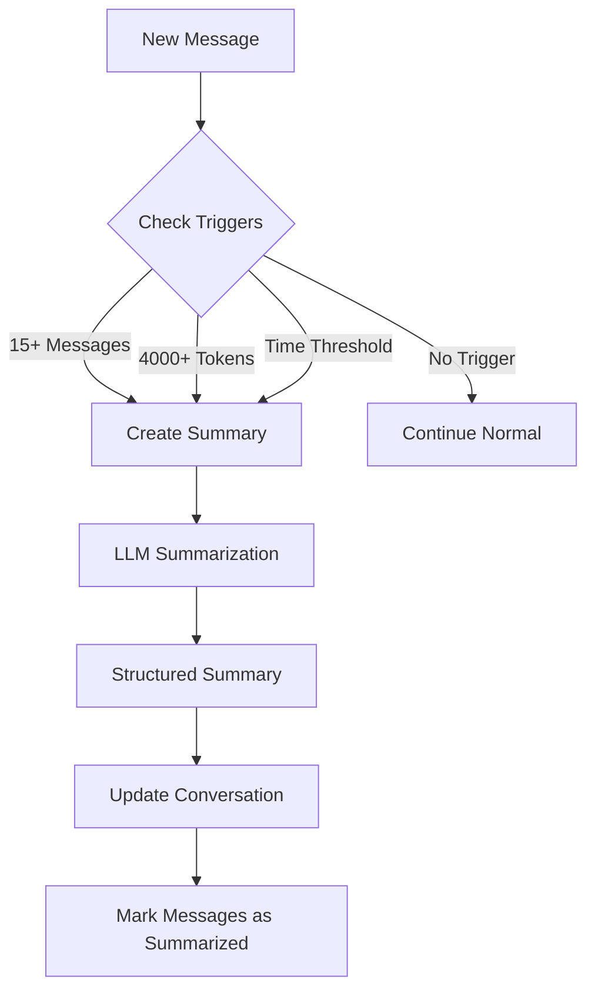

# Conversation Summarization

One of LLM Crafter's most powerful features is automatic conversation summarization, which reduces token usage by up to 70% while preserving important context and information.

## Overview

As conversations grow longer, they consume more tokens and increase costs. LLM Crafter automatically summarizes conversations to maintain context while dramatically reducing the number of tokens needed for each interaction.

### Key Benefits

- **70% Token Reduction**: Dramatically lower API costs for long conversations
- **Faster Responses**: 30-50% faster response times
- **Context Preservation**: Important information is retained
- **Automatic Processing**: No manual intervention required
- **Cost Optimization**: Uses efficient models for summarization

## How It Works

### Automatic Triggers

Summarization is triggered automatically based on:

1. **Message Count**: Every 15 messages after the last summary
2. **Token Threshold**: When conversation context exceeds 4,000 tokens
3. **Time-based**: After periods of inactivity (configurable)

### Summarization Process



### Summary Structure

Summaries are created in a structured format that preserves the most important information:

```json
{
  "key_topics": [
    "e-commerce website setup",
    "bookstore specialization",
    "Shopify platform selection",
    "rare books and collectibles"
  ],
  "important_decisions": [
    "Budget set at $5000",
    "Shopify chosen as platform",
    "Focus on rare books and collectibles",
    "Square POS integration needed"
  ],
  "unresolved_issues": [
    "Specific Square integration method",
    "Website design details",
    "Authentication certificate process"
  ],
  "user_preferences": {
    "budget": "$5000",
    "platform": "Shopify",
    "business_type": "rare books and collectibles",
    "pos_system": "Square",
    "design_preference": "minimalist"
  },
  "context_data": {
    "business_focus": "rare books and collectibles",
    "has_physical_store": true,
    "current_pos": "Square"
  }
}
```

## Model Selection

LLM Crafter automatically selects cost-effective models for summarization:

| Agent Model | Summarization Model | Savings            |
| ----------- | ------------------- | ------------------ |
| gpt-4o      | gpt-4o-mini         | 95% cost reduction |
| gpt-5       | gpt-5-mini          | 95% cost reduction |
| o3          | o3-mini             | 90% cost reduction |
| o1          | o1-mini             | 90% cost reduction |

### Custom Model Configuration

You can configure summarization models per agent:

```bash
POST /api/v1/organizations/{orgId}/projects/{projectId}/agents/{agentId}/api-config
```

```json
{
  "summarization": {
    "enabled": true,
    "model": "gpt-3.5-turbo",
    "max_tokens": 200,
    "min_size": 800,
    "focus": "customer preferences and key decisions"
  }
}
```

## API Integration

### Manual Summarization

Force summarization of a conversation:

```bash
POST /api/v1/organizations/{orgId}/projects/{projectId}/agents/{agentId}/conversations/{conversationId}/summarize
```

**Response:**

```json
{
  "message": "Conversation summarized successfully",
  "summary": {
    "key_topics": ["..."],
    "important_decisions": ["..."],
    "unresolved_issues": ["..."],
    "user_preferences": {},
    "context_data": {}
  },
  "summary_status": {
    "has_summary": true,
    "messages_count": 25,
    "last_summary_index": 19,
    "summary_version": 1,
    "requires_summarization": false,
    "estimated_token_savings": 1250
  }
}
```

### Get Summary Status

Check if a conversation has been summarized:

```bash
GET /api/v1/organizations/{orgId}/projects/{projectId}/agents/{agentId}/conversations/{conversationId}/summary
```

**Response:**

```json
{
  "summary": {
    "key_topics": ["..."],
    "important_decisions": ["..."],
    "unresolved_issues": ["..."],
    "user_preferences": {},
    "context_data": {}
  },
  "summary_status": {
    "has_summary": true,
    "messages_count": 25,
    "messages_since_last_summary": 5,
    "last_summary_index": 19,
    "summary_version": 1,
    "requires_summarization": false,
    "estimated_token_savings": 1250
  }
}
```

## Configuration Options

### Global Configuration

Set system-wide summarization defaults in your environment:

```bash
# Summarization triggers
SUMMARIZATION_MESSAGE_THRESHOLD=15
SUMMARIZATION_TOKEN_THRESHOLD=4000
SUMMARIZATION_TIME_THRESHOLD=3600000  # 1 hour

# Performance settings
SUMMARIZATION_MODEL=gpt-4o-mini
SUMMARIZATION_MAX_TOKENS=800
SUMMARIZATION_TEMPERATURE=0.3
```

### Agent-Level Configuration

Configure summarization per agent:

```json
{
  "summarization": {
    "enabled": true,
    "model": "gpt-3.5-turbo",
    "max_tokens": 150,
    "min_size": 800,
    "focus": "customer service interactions and resolution status",
    "triggers": {
      "message_count": 10,
      "token_threshold": 3000,
      "time_threshold": 1800000
    }
  }
}
```

### Endpoint-Specific Rules

For agents using the API caller tool, configure summarization per endpoint:

```json
{
  "summarization": {
    "enabled": true,
    "endpoint_rules": {
      "get_weather": {
        "max_tokens": 100,
        "focus": "current temperature, weather condition, wind, humidity"
      },
      "get_user_profile": {
        "max_tokens": 80,
        "focus": "user preferences, account status, recent activity"
      }
    }
  }
}
```

## Performance Metrics

### Token Savings Example

Before summarization (typical 20-message conversation):

```json
{
  "original_tokens": 3500,
  "estimated_cost": "$0.0175"
}
```

After summarization:

```json
{
  "summary_tokens": 200,
  "context_tokens": 800,
  "total_tokens": 1000,
  "estimated_cost": "$0.005",
  "savings": {
    "tokens": 2500,
    "percentage": "71%",
    "cost_reduction": "$0.0125"
  }
}
```

### Response Time Improvement

```json
{
  "without_summarization": {
    "average_response_time": "2.5s",
    "token_processing_time": "1.8s"
  },
  "with_summarization": {
    "average_response_time": "1.5s",
    "token_processing_time": "0.8s",
    "improvement": "40% faster"
  }
}
```

## Monitoring and Analytics

### Summarization Metrics

The system logs detailed metrics for monitoring:

```json
{
  "conversation_id": "conv_123",
  "messages_summarized": 15,
  "total_messages": 25,
  "summary_version": 1,
  "tokens_used": 250,
  "cost": 0.001,
  "model_used": "gpt-4o-mini",
  "processing_time_ms": 1200,
  "token_savings": 1250,
  "compression_ratio": 0.71
}
```

### Dashboard Metrics

Track summarization performance across your organization:

- **Total Token Savings**: Cumulative tokens saved
- **Cost Reduction**: Monthly cost savings from summarization
- **Conversation Length**: Average messages per conversation
- **Summarization Rate**: Percentage of conversations summarized
- **Performance Impact**: Response time improvements

## Best Practices

### Summarization Focus

Configure summarization to focus on what matters for your use case:

#### Customer Support

```json
{
  "focus": "customer issue description, troubleshooting steps taken, resolution status, and customer satisfaction"
}
```

#### Sales Conversations

```json
{
  "focus": "customer needs, budget, decision timeline, objections raised, and next steps"
}
```

#### Technical Consultations

```json
{
  "focus": "technical requirements, proposed solutions, limitations, and implementation decisions"
}
```

### Token Optimization

#### Aggressive Summarization (High Volume)

```json
{
  "triggers": {
    "message_count": 10,
    "token_threshold": 2000
  },
  "max_tokens": 100
}
```

#### Conservative Summarization (Quality Focus)

```json
{
  "triggers": {
    "message_count": 20,
    "token_threshold": 5000
  },
  "max_tokens": 300
}
```

### Quality Assurance

#### Monitor Summary Quality

- Review summaries periodically
- Check for information loss
- Adjust focus parameters as needed

#### A/B Testing

- Test different summarization settings
- Compare customer satisfaction metrics
- Measure response quality impact

## Error Handling

### Fallback Strategies

If LLM summarization fails, the system provides fallbacks:

1. **Simple Text Summary**: Basic extraction of key information
2. **Truncation**: Remove oldest messages while preserving recent context
3. **No Summarization**: Continue without summarization if fallbacks fail

### Error Recovery

```json
{
  "error_handling": {
    "retry_attempts": 3,
    "fallback_enabled": true,
    "continue_on_failure": true,
    "alert_on_failure": true
  }
}
```

## Advanced Features

### Incremental Summarization

For very long conversations, summaries can be updated incrementally:

```json
{
  "incremental_mode": {
    "enabled": true,
    "update_interval": 10,
    "max_increments": 5
  }
}
```

### Custom Summarization Prompts

Customize the summarization prompt for specific domains:

```json
{
  "custom_prompt": "Analyze this customer support conversation and extract: 1) The customer's main issue, 2) Steps taken to resolve it, 3) Current status, 4) Any follow-up needed. Focus on actionable information for the next support agent."
}
```

### Multi-Language Support

Summarization works across multiple languages:

```json
{
  "language_settings": {
    "detect_language": true,
    "preserve_language": true,
    "translation_summaries": false
  }
}
```

## Testing and Validation

### Test Summarization

Use the test script to validate summarization:

```bash
node test-conversation-summarization.js
```

This script simulates a long conversation and demonstrates:

- Token savings calculation
- Summary structure
- Performance improvements

### Validate Results

Check summarization quality:

```bash
# Get conversation summary
curl -X GET "http://localhost:3000/api/v1/organizations/{orgId}/projects/{projectId}/agents/{agentId}/conversations/{conversationId}/summary" \
  -H "Authorization: Bearer $TOKEN"

# Review summary content
# Verify key information is preserved
# Check token savings metrics
```

## Troubleshooting

### Common Issues

#### Summarization Not Triggering

- Check message count threshold
- Verify token threshold settings
- Ensure agent has valid API key

#### Poor Summary Quality

- Adjust focus parameters
- Increase max_tokens for summaries
- Review and refine system prompts

#### High Costs

- Verify summarization model selection
- Check if summarization is actually reducing tokens
- Monitor actual vs. estimated savings

### Debug Mode

Enable detailed logging for troubleshooting:

```bash
LOG_LEVEL=debug npm start
```

This provides detailed information about:

- Summarization triggers
- Token calculations
- Model selection
- Processing times

## Next Steps

- Review [API Integration Examples](/examples/conversations) for implementation details
- Learn about [Agent Configuration](/concepts/agents) to optimize performance
- Explore [Cost Optimization Strategies](/development/cost-optimization) for maximum savings
